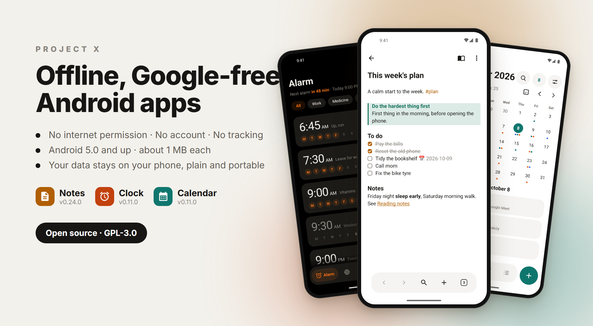
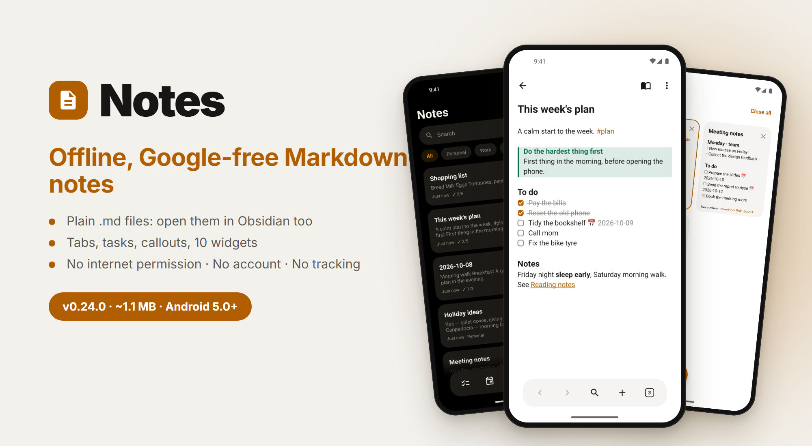
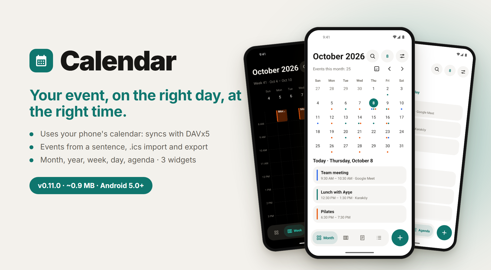
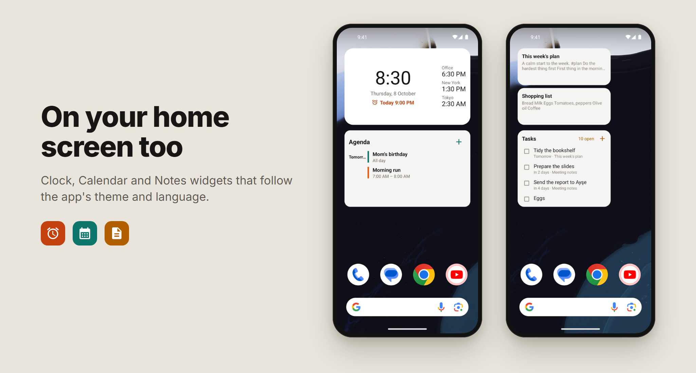

<p align="center">
  
</p>

<p align="center">
  <b>English</b> · <a href="README.tr.md">Türkçe</a>
</p>

<p align="center">
  
  
  
  
</p>

# Project X

A family of small, offline, Google-free Android apps. **No internet permission, no accounts, no tracking, no cloud.** Each app is about 1 MB, runs on Android 5.0 and up, and keeps your data in plain, portable places: Markdown files for notes, your phone's own calendar for events.

Made for people who de-Google their phones and for people who want to give an old phone a second life.

*Project X is a working name; the final name will come later.*

## Apps

| | App | In one line | Version | |
|:-:|---|---|:-:|:-:|
| 📝 | **[Notes](notlar/README.md)** | Markdown notes in plain files, with tabs, tasks and 10 widgets | 0.24.0 | [Download](https://github.com/fusion-enjoyer/project-x/releases/tag/notlar-v0.24.0) |
| ⏰ | **[Clock](saat/README.md)** | Alarm, timer, stopwatch and world clock. Your alarm rings. | 0.11.0 | [Download](https://github.com/fusion-enjoyer/project-x/releases/tag/saat-v0.11.0) |
| 📅 | **[Calendar](takvim/README.md)** | Your phone's calendar, with month, year, week, day and agenda | 0.11.0 | [Download](https://github.com/fusion-enjoyer/project-x/releases/tag/takvim-v0.11.0) |
| 🖼️ | Gallery | Photos and videos, offline | In development | |
| 👤 | Contacts | | Planned | |
| 🎵 | Music | | Planned | |
| 🏠 | Launcher | | Planned | |

### 📝 Notes

[](notlar/README.md)

Every note is a `.md` file in a folder you pick, so Obsidian, Syncthing or any file manager can open the same notes. Live Markdown, tabs like Obsidian, tasks with due dates, callouts, encrypted notes, version history and Google Keep import. **[All features →](notlar/README.md)**

### ⏰ Clock

[](saat/README.md)

Built around one promise: **your alarm rings.** On the lock screen, in silent mode, after a reboot, even before you unlock the phone. Timers, stopwatch, world clock, clock mode and screen saver. **[All features →](saat/README.md)**

### 📅 Calendar

[](takvim/README.md)

Uses your phone's calendar storage, so calendars synced by DAVx5 show up without the app ever touching the internet. Type "Friday 7pm cinema for 2 hours" and it fills in the event. **[All features →](takvim/README.md)**

## On your home screen



Notes has 10 widgets, Clock has 5 and Calendar has 3. They follow the app's theme and language, and notes look the same on the home screen as in the app.

## What every app promises

- **No internet permission.** The apps can't connect to anything, not even to report a crash. Check the permissions in the app's info screen.
- **No account, no tracking, no ads.**
- **Your data stays yours.** Notes are plain Markdown files; events live in Android's own calendar storage. Nothing is locked inside the app.
- **Small and light.** About 1 MB each, no heavy libraries.
- **Old phones welcome.** Android 5.0 and up. Newer Android features (Material You colors, per-app language, predictive back) turn on where available and quietly stay off on older phones.
- **Turkish and English.**
- **Open source**, GPL-3.0.

Each app's page has a table showing which feature needs which Android version.

## Coming next

- **Gallery** is in development: browse, search, edit (rotate, crop), GIFs, slideshow, locked folder.
- **Contacts**, **Music** and a **Launcher** that ties the family together.
- Notes: link graph, tables, nested folders, automatic local backup.
- Clock: sunrise alarm, bedtime reminder, more ways to dismiss an alarm.
- Calendar: public holidays, Hijri date, a link with Clock's vacation mode.

Each app's page lists its own plans in more detail.

## Install

Download the APK from [Releases](https://github.com/fusion-enjoyer/project-x/releases) and open it. All apps are signed with the same key:

```
SHA-256: e0:55:84:ff:75:ff:a6:b0:76:55:f3:b9:03:05:6d:e4:95:a9:ae:20:16:7f:61:c0:82:6f:39:75:c7:0c:d2:6c
```

## Build

You need JDK 17 and the Android SDK (compileSdk 36).

```bash
./gradlew :notlar:assembleRelease
./gradlew :saat:assembleRelease
./gradlew :takvim:assembleRelease
```

Without a signing setup the release builds are unsigned. Module names are Turkish: `notlar` = Notes, `saat` = Clock, `takvim` = Calendar, `tasarim` = the shared design module.

## License

[GPL-3.0](LICENSE)
