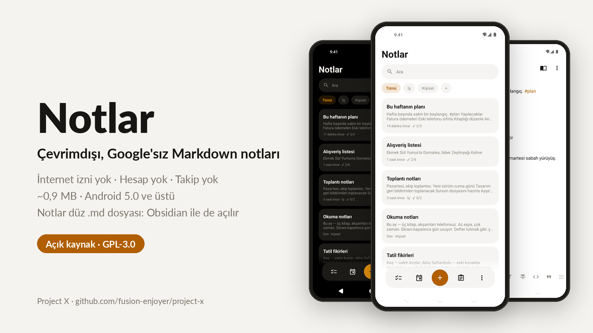
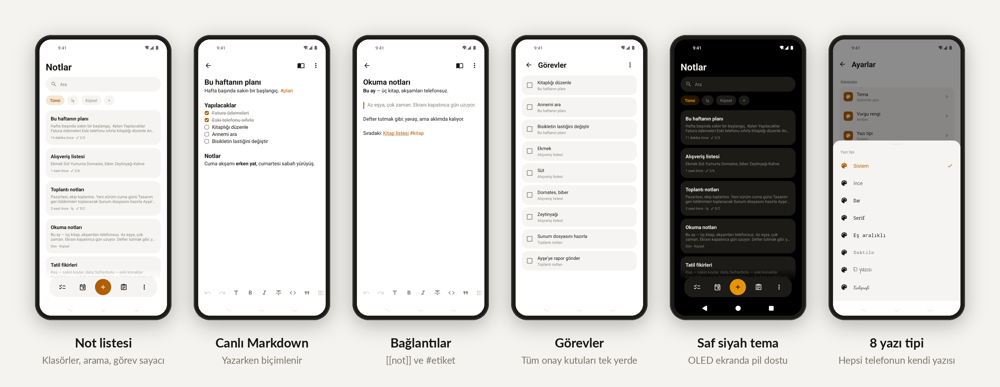

# Project X



<h1 align="center">

[🇺🇸](https://github.com/fusion-enjoyer/project-x/blob/main/README.md) [🇹🇷](https://github.com/fusion-enjoyer/project-x/blob/main/README.tr.md)

</h1>

A family of small, offline, Google-free Android apps. No internet permission, no accounts, no tracking, no cloud. Each app is small, runs on Android 5.0 and up, and keeps your data in plain, portable files.

*Project X is a working name; the final name will come later.*

## Apps

| App | Status |
|---|---|
| **Notes** (`notlar/`) | Available, v0.24.0 |
| Clock | Planned |
| Calendar | Planned |
| Contacts | Planned |
| Gallery | Planned |
| Music | Planned |
| Launcher | Planned |

## Notes

A Markdown note app that stays out of your way.



- **Plain files.** Every note is a `.md` file in a folder you pick. You can open the same folder in Obsidian, sync it with Syncthing, or back it up however you like.

- **Live Markdown.** Headings, bold, italic, strikethrough, code, quotes, lists, checkboxes, dividers and Obsidian-style callouts (`> [!tip]`) are formatted as you type. The markers show only on the line you're editing.

- **Tabs, like Obsidian.** Open several notes at once. When the keyboard is closed, a floating bar gives you back, forward, go to note, new tab and your tabs, shown as cards with a preview. Tabs are remembered after you close the app.

- **Organize.** Folders, `#tags`, `[[wiki links]]` with backlinks, pinning, templates, a daily note, table of contents, splitting and merging notes.

- **Tasks.** Checkboxes from all your notes are collected on one screen, with due dates (`📅 2026-10-20`, the Obsidian Tasks format) and repeating reminders.

- **Find and replace** inside a note, plus search across all notes. Search ignores Turkish accents, so "toplanti" also finds "toplantı".

- **Version history.** See what would change before you restore an older version. A trash with swipe to restore or delete.

- **Images** stored next to your notes as standard Markdown (``). Take a photo straight into a note, share a note as an image, print or save as PDF.

- **Privacy.** App lock with a PIN and fingerprint, per-note lock, password-encrypted notes (AES-256, Android 8+), screenshot blocking.

- **Sync friendly.** Finds and resolves Syncthing conflict copies.

- **Backup.** Export and import as a zip, and import from Google Keep (Takeout).

- **Your look.** Light, dark and pure black themes, 9 accent colors or your system color (Material You), 8 fonts, 4 text sizes.

- **Widgets.** Ten home-screen widgets: tasks you can tick, today's note, quick actions, pinned notes, a folder or tag, upcoming, on this day, a single note and more. Notes look the same on the home screen as in the app.

- **System integration.** A quick settings tile, app shortcuts, and "Add to notes" from the share menu and the text selection menu.

- Turkish and English.

**Size:** about 1.1 MB. **Permissions:** notifications (reminders), run at startup (to restore reminders after a reboot), biometrics (optional fingerprint unlock). Never internet.

### Install

Download the APK from [Releases](../../releases).

### Build

You need JDK 17 and the Android SDK (compileSdk 36).

```bash
./gradlew :notlar:assembleRelease
```

Without a signing setup the release build is unsigned.
