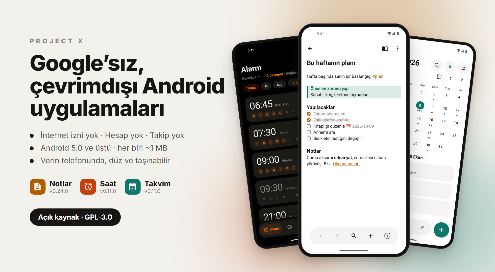
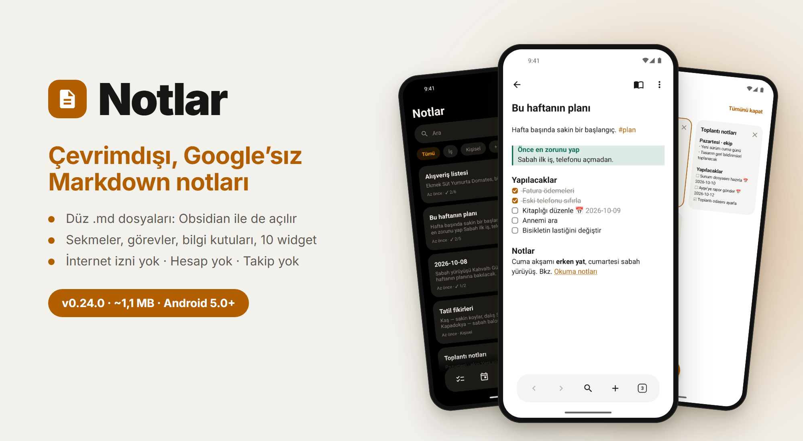
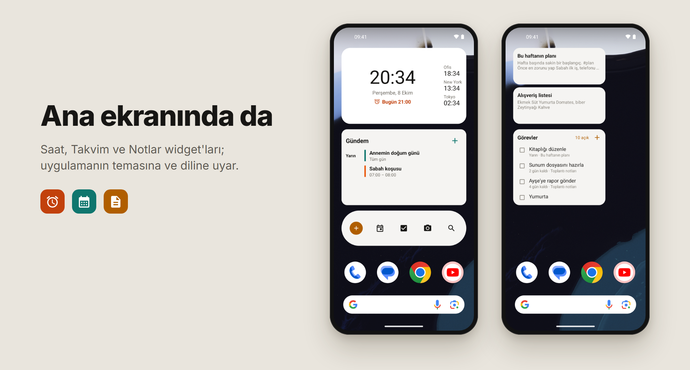

<p align="center">
  
</p>

<p align="center">
  <a href="README.md">English</a> · <b>Türkçe</b>
</p>

<p align="center">
  
  
  
  
</p>

# Project X

Google'sız, çevrimdışı, küçük Android uygulamalarından oluşan bir aile. **İnternet izni yok, hesap yok, takip yok, bulut yok.** Her uygulama yaklaşık 1 MB, Android 5.0 ve üstünde çalışır ve verini düz, taşınabilir yerlerde tutar: notlar Markdown dosyalarında, etkinlikler telefonun kendi takviminde.

Telefonunu Google'dan arındıranlar ve eski telefonuna yeniden hayat vermek isteyenler için.

*Project X geçici bir ad; asıl ad sonra gelecek.*

## Uygulamalar

| | Uygulama | Tek cümlede | Sürüm | |
|:-:|---|---|:-:|:-:|
| 📝 | **[Notlar](notlar/README.tr.md)** | Düz dosyalarda Markdown notlar; sekmeler, görevler ve 10 widget | 0.24.0 | [İndir](https://github.com/fusion-enjoyer/project-x/releases/tag/notlar-v0.24.0) |
| ⏰ | **[Saat](saat/README.tr.md)** | Alarm, zamanlayıcı, kronometre ve dünya saati. Alarmın çalar. | 0.11.0 | [İndir](https://github.com/fusion-enjoyer/project-x/releases/tag/saat-v0.11.0) |
| 📅 | **[Takvim](takvim/README.tr.md)** | Telefonunun takvimi: ay, yıl, hafta, gün ve gündem | 0.11.0 | [İndir](https://github.com/fusion-enjoyer/project-x/releases/tag/takvim-v0.11.0) |
| 🖼️ | Galeri | Fotoğraf ve videolar, çevrimdışı | Geliştiriliyor | |
| 👤 | Rehber | | Planlandı | |
| 🎵 | Müzik | | Planlandı | |
| 🏠 | Başlatıcı (launcher) | | Planlandı | |

### 📝 Notlar

[](notlar/README.tr.md)

Her not, seçtiğin klasörde düz bir `.md` dosyasıdır; aynı notları Obsidian, Syncthing ya da herhangi bir dosya yöneticisi açabilir. Canlı Markdown, Obsidian gibi sekmeler, son tarihli görevler, bilgi kutuları, şifreli notlar, sürüm geçmişi ve Google Keep'ten aktarma. **[Bütün özellikler →](notlar/README.tr.md)**

### ⏰ Saat

[](saat/README.tr.md)

Tek bir söz üstüne kurulu: **alarmın çalar.** Kilit ekranında, sessiz modda, telefon yeniden başladıktan sonra, kilidi hiç açmasan bile. Zamanlayıcılar, kronometre, dünya saati, saat modu ve ekran koruyucu. **[Bütün özellikler →](saat/README.tr.md)**

### 📅 Takvim

[](takvim/README.tr.md)

Telefonun takvim deposunu kullanır; DAVx5 ile senkronlanan takvimler, uygulama internete hiç dokunmadan görünür. "Cuma 19:00 sinema 2 saat" yaz, etkinliği kendisi doldursun. **[Bütün özellikler →](takvim/README.tr.md)**

## Ana ekranında da



Notlar'da 10, Saat'te 5, Takvim'de 3 widget var. Uygulamanın temasına ve diline uyarlar; notlar ana ekranda da uygulamadaki gibi görünür.

## Her uygulamanın sözü

- **İnternet izni yok.** Uygulamalar hiçbir yere bağlanamaz, çökme raporu bile gönderemez. İzinleri uygulama bilgisi ekranından kontrol edebilirsin.
- **Hesap yok, takip yok, reklam yok.**
- **Verin senin.** Notlar düz Markdown dosyaları, etkinlikler Android'in kendi takvim deposunda. Hiçbir şey uygulamanın içine kilitlenmez.
- **Küçük ve hafif.** Her biri yaklaşık 1 MB, ağır kütüphane yok.
- **Eski telefonlar da.** Android 5.0 ve üstü. Yeni Android özellikleri (Material You rengi, uygulamaya özel dil, geri hareketi önizlemesi) destekleyen telefonda açılır, eskisinde sessizce kapalı kalır.
- **Türkçe ve İngilizce.**
- **Açık kaynak**, GPL-3.0.

Her uygulamanın sayfasında hangi özelliğin hangi Android sürümünde çalıştığını gösteren bir tablo var.

## Sırada ne var

- **Galeri** geliştiriliyor: göz atma, arama, düzenleme (döndür, kırp), GIF, slayt gösterisi, kilitli klasör.
- **Rehber**, **Müzik** ve aileyi bir araya getiren bir **Başlatıcı**.
- Notlar: bağlantı grafiği, tablolar, iç içe klasörler, otomatik yerel yedek.
- Saat: gün doğumu alarmı, uyku vakti hatırlatıcısı, alarmı kapatmanın yeni yolları.
- Takvim: resmî tatiller, Hicri tarih, Saat'in tatil moduyla bağlantı.

Her uygulamanın kendi planları sayfasında daha ayrıntılı.

## Kurulum

APK'yı [Releases](https://github.com/fusion-enjoyer/project-x/releases) sayfasından indirip aç. Bütün uygulamalar aynı anahtarla imzalı:

```
SHA-256: e0:55:84:ff:75:ff:a6:b0:76:55:f3:b9:03:05:6d:e4:95:a9:ae:20:16:7f:61:c0:82:6f:39:75:c7:0c:d2:6c
```

## Derleme

JDK 17 ve Android SDK (compileSdk 36) gereklidir.

```bash
./gradlew :notlar:assembleRelease
./gradlew :saat:assembleRelease
./gradlew :takvim:assembleRelease
```

İmza ayarı yoksa release sürümleri imzasız derlenir. `tasarim` modülü uygulamaların ortak tasarım parçalarıdır.

## Lisans

[GPL-3.0](LICENSE)
