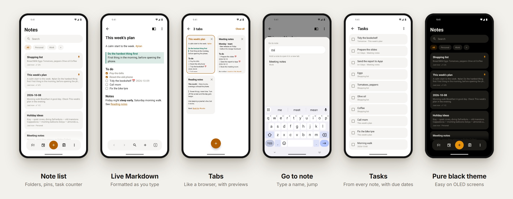

<p align="center">
  
</p>

<p align="center">
  <b>English</b> · <a href="README.tr.md">Türkçe</a> · <a href="../README.md">← Project X</a>
</p>

# Notes

A Markdown note app that stays out of your way. Offline, no account, no internet permission.

**Version 0.24.0** · about 1.1 MB · Android 5.0+ · **[Download](https://github.com/fusion-enjoyer/project-x/releases/tag/notlar-v0.24.0)**



## Features

### Writing

- **Live Markdown.** Headings, bold, italic, strikethrough, code, quotes, lists, checkboxes, dividers and code blocks are formatted as you type. The markers show only on the line you're editing.
- **Obsidian-style callouts** (`> [!tip]`) in color.
- A floating formatting bar while you type: undo/redo, headings, lists, checkboxes, callouts, images, tags, date and time, indent.
- **Find and replace** inside a note; reading view and source mode.
- Links: `[[wiki links]]` with suggestions as you type, web links, and backlinks to see which notes link here.
- Table of contents, split a note at a line, merge notes.
- 8 fonts (all built into the phone, 0 bytes), 4 text sizes.

### Tabs, like Obsidian

- Keep several notes open at once. When the keyboard is closed, a floating bar gives you **back, forward, go to note, new tab** and **your tabs**.
- The tabs screen looks like a mobile browser: cards with a preview of each note. Swipe or tap × to close.
- Following a `[[link]]` opens in the same tab; back takes you back. Tabs are remembered after you close the app.

### Organize

- Folders, `#tags`, pinning, templates and a **daily note**.
- Multi-select: move, pin, tag, merge, share or delete several notes at once.
- Trash with swipe to restore or delete for good.
- **Version history:** see what would change before you restore an older version.

### Tasks

- Checkboxes from all your notes on one screen.
- **Due dates** in the Obsidian Tasks format (`📅 2026-10-20`); overdue ones turn red.
- Reminders, including repeating ones (daily, weekly, monthly).

### Search

- Search across all notes, with matching lines highlighted.
- Ignores Turkish accents: "toplanti" also finds "toplantı".
- **Go to note:** type part of a name and jump. Hold a note to open it in a new tab.

### Images

- Stored next to your notes as standard Markdown (``), shown inline.
- Take a photo straight into a note. Images can be shrunk to 2048 px and EXIF (location) removed.
- Share a note as an image, print it or save it as PDF.

### Privacy

- App lock with a PIN and fingerprint; per-note lock.
- **Password-encrypted notes** (PBKDF2 + AES-256-GCM).
- Screenshot blocking; the note is hidden in Recents while locked.

### Your files, your way

- Every note is a plain `.md` file in a folder you pick. Open the same folder in **Obsidian**, sync it with **Syncthing**, or back it up however you like.
- Finds and resolves Syncthing conflict copies.
- Zip backup and restore; **import from Google Keep** (Takeout) with lists, labels, photos, pins and dates.

### Widgets

Ten home-screen widgets, following the app's theme and language:

| | | |
|---|---|---|
| Tasks (tick them right there) | Today's note | Quick actions (new note, today, task, photo, search) |
| Pinned notes (1 to 4 cards, any size) | A folder or tag | Upcoming reminders and due dates |
| On this day | A single note | Note list, quick new note |

Plus a quick settings tile, app shortcuts, and "Add to notes" from the share menu and the text selection menu.

### Look

Light, dark and pure black themes; 9 accent colors or your phone's own color (Material You). Turkish and English.

## Android versions

Notes runs on **Android 5.0 and up**. Everything not in this table works on 5.0. Newer features turn on where Android supports them and quietly stay off on older phones.

| Feature | Needs |
|---|---|
| "Add to notes" in the text selection menu | Android 6.0 |
| Quick settings tile | Android 7.0 |
| App shortcuts (hold the app icon) | Android 7.1 |
| Password-encrypted notes | Android 8.0 |
| Fingerprint unlock (face and iris: Android 10) | Android 9 |
| Your phone's accent color (Material You), widget previews in the picker | Android 12 |
| System photo picker | Android 13 (11 and 12 with a system update) |
| Separate app language, note hidden in Recents while locked | Android 13 |
| Predictive back animation | Android 14 |

So far Notes has been tested mostly on Android 14 and on a real phone; older versions are supported by design but tested less.

## Permissions

| Permission | Why |
|---|---|
| Notifications | Reminders |
| Run at startup | Put reminders back after the phone restarts |
| Biometrics | Optional fingerprint unlock |

Never internet.

## Coming next

- Link graph of your notes
- Simple tables; image alignment and size
- Nested folder navigation
- Search filters (folder, tag, date, has tasks), saved searches
- Hide finished tasks, archive separate from the trash
- Automatic local backup to a folder you pick
- Export a single note as `.md` or `.txt`; import from Fossify Notes and Standard Notes
- Grid view, note colors, widget transparency
- More languages

## Build

```bash
./gradlew :notlar:assembleRelease
```

The source is in [`src/main`](src/main); the Kotlin code is in `src/main/java/com/ekosistem/notlar`.
