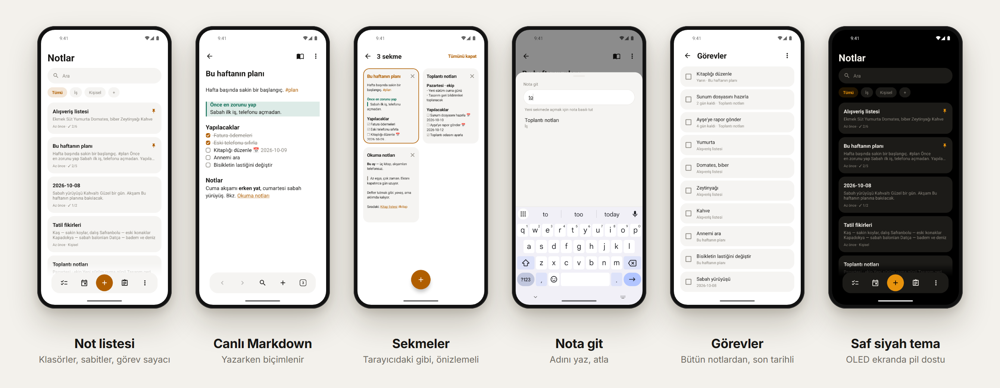

<p align="center">
  
</p>

<p align="center">
  <a href="README.md">English</a> · <b>Türkçe</b> · <a href="../README.tr.md">← Project X</a>
</p>

# Notlar

Yolunuza çıkmayan bir Markdown not uygulaması. Çevrimdışı, hesapsız, internet izni yok.

**Sürüm 0.24.0** · yaklaşık 1,1 MB · Android 5.0+ · **[İndir](https://github.com/fusion-enjoyer/project-x/releases/tag/notlar-v0.24.0)**



## Özellikler

### Yazmak

- **Canlı Markdown.** Başlık, kalın, italik, üstü çizili, kod, alıntı, liste, onay kutusu, ayırıcı ve kod blokları yazarken biçimlenir. İşaretler yalnız düzenlediğin satırda görünür.
- Renkli **Obsidian bilgi kutuları** (`> [!tip]`).
- Yazarken yüzen biçim çubuğu: geri al/yinele, başlık, liste, onay kutusu, bilgi kutusu, görsel, etiket, tarih ve saat, girinti.
- Not içinde **bul ve değiştir**; okuma görünümü ve kaynak modu.
- Bağlantılar: yazarken öneri çıkan `[[wiki bağlantılar]]`, web bağlantıları ve bu nota hangi notların bağlandığını gösteren geri bağlantılar.
- İçindekiler, notu bir satırdan bölme, notları birleştirme.
- 8 yazı tipi (hepsi telefonun kendi yazısı, 0 bayt), 4 yazı boyu.

### Obsidian gibi sekmeler

- Birkaç notu aynı anda açık tut. Klavye kapalıyken havada duran çubukta **geri, ileri, nota git, yeni sekme** ve **sekmelerin** var.
- Sekmeler ekranı mobil tarayıcı gibi: her notun önizlemesiyle kartlar. Kaydırarak ya da × ile kapat.
- `[[bağlantı]]` aynı sekmede açılır, geri tuşu seni geri götürür. Sekmeler uygulama kapansa da hatırlanır.

### Düzen

- Klasörler, `#etiket`, sabitleme, şablonlar ve **günlük not**.
- Çoklu seçim: birkaç notu birden taşı, sabitle, etiketle, birleştir, paylaş ya da sil.
- Kaydırarak geri yüklenen ya da kalıcı silinen çöp kutusu.
- **Sürüm geçmişi:** eski bir sürüme dönmeden önce nelerin değişeceğini gör.

### Görevler

- Bütün notlardaki onay kutuları tek ekranda.
- Obsidian Tasks biçiminde **son tarih** (`📅 2026-10-20`); geçenler kırmızı.
- Hatırlatıcılar; yinelenenler de (her gün, her hafta, her ay).

### Arama

- Bütün notlarda arama, eşleşen satırlar vurgulu.
- Türkçe karakterden bağımsız: "toplanti" araması "toplantı"yı da bulur.
- **Nota git:** adının bir kısmını yaz, atla. Basılı tutarsan yeni sekmede açılır.

### Görseller

- Notların yanında standart Markdown olarak saklanır (``), satır içinde görünür.
- Kameradan doğrudan nota fotoğraf. Görseller 2048 piksele küçültülebilir, EXIF (konum) silinir.
- Notu görsel olarak paylaş, yazdır ya da PDF olarak kaydet.

### Gizlilik

- PIN ve parmak iziyle uygulama kilidi; nota özel kilit.
- **Parolayla şifrelenmiş notlar** (PBKDF2 + AES-256-GCM).
- Ekran görüntüsü engelleme; kilitliyken son uygulamalarda not görünmez.

### Dosyaların senin

- Her not, seçtiğin klasörde düz bir `.md` dosyasıdır. Aynı klasörü **Obsidian** ile aç, **Syncthing** ile eşitle, dilediğin gibi yedekle.
- Syncthing çakışma kopyalarını bulur ve çözer.
- Zip olarak yedekleme ve geri yükleme; listeleri, etiketleri, fotoğrafları, sabitleri ve tarihleriyle **Google Keep'ten aktarma** (Takeout).

### Widget'lar

Uygulamanın temasına ve diline uyan on ana ekran widget'ı:

| | | |
|---|---|---|
| Görevler (oradan işaretlenir) | Bugünün notu | Hızlı eylemler (yeni not, bugün, görev, fotoğraf, ara) |
| Sabitlenmiş notlar (boyuta göre 1–4 kart) | Bir klasör ya da etiket | Yaklaşan hatırlatıcılar ve son tarihler |
| Geçmişte bugün | Tek not | Not listesi, hızlı yeni not |

Ayrıca hızlı ayarlar döşemesi, uygulama kısayolları ve paylaşım ile metin seçimi menülerinden "Notlara ekle".

### Görünüm

Açık, koyu ve saf siyah tema; 9 vurgu rengi ya da telefonunun kendi rengi (Material You). Türkçe ve İngilizce.

## Android sürümleri

Notlar **Android 5.0 ve üstünde** çalışır. Bu tabloda olmayan her şey 5.0'da çalışır. Yeni özellikler Android'in desteklediği telefonda açılır, eskisinde sessizce kapalı kalır.

| Özellik | Gereken |
|---|---|
| Metin seçimi menüsünde "Notlara ekle" | Android 6.0 |
| Hızlı ayarlar döşemesi | Android 7.0 |
| Uygulama kısayolları (simgeye basılı tut) | Android 7.1 |
| Parolayla şifrelenmiş notlar | Android 8.0 |
| Parmak iziyle açma (yüz ve iris: Android 10) | Android 9 |
| Telefonun vurgu rengi (Material You), widget seçicide önizleme | Android 12 |
| Sistemin fotoğraf seçicisi | Android 13 (11 ve 12'de sistem güncellemesiyle) |
| Uygulamaya özel dil, kilitliyken son uygulamalarda not gizli | Android 13 |
| Geri hareketi önizlemesi | Android 14 |

Notlar şimdiye dek çoğunlukla Android 14'te ve gerçek bir telefonda denendi; eski sürümler tasarım olarak destekleniyor ama daha az denendi.

## İzinler

| İzin | Neden |
|---|---|
| Bildirimler | Hatırlatıcılar |
| Başlangıçta çalıştır | Telefon yeniden başlayınca hatırlatıcıları geri kurmak |
| Biyometri | İsteğe bağlı parmak iziyle açma |

İnternet izni asla yok.

## Sırada ne var

- Notların bağlantı grafiği
- Basit tablolar; görsel hizalama ve boyut
- İç içe klasörlerde gezinme
- Arama süzgeçleri (klasör, etiket, tarih, görev içeren), kayıtlı aramalar
- Biten görevleri gizleme, çöp kutusundan ayrı arşiv
- Seçilen klasöre otomatik yerel yedek
- Tek notu `.md` ya da `.txt` olarak dışa aktarma; Fossify Notes ve Standard Notes'tan aktarma
- Izgara görünümü, not renkleri, widget saydamlığı
- Başka diller

## Derleme

```bash
./gradlew :notlar:assembleRelease
```

Kaynak kod [`src/main`](src/main) içinde; Kotlin kodu `src/main/java/com/ekosistem/notlar` klasöründe.
