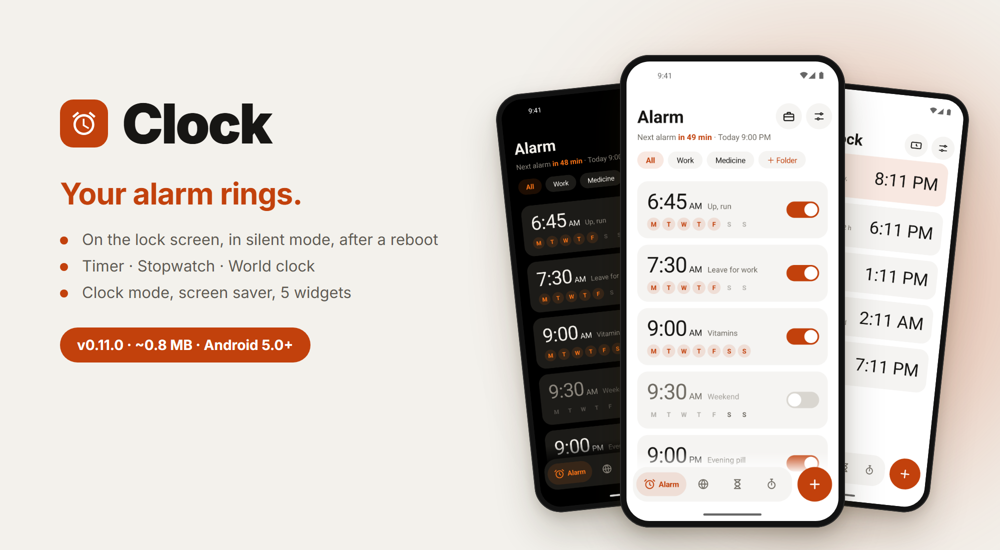
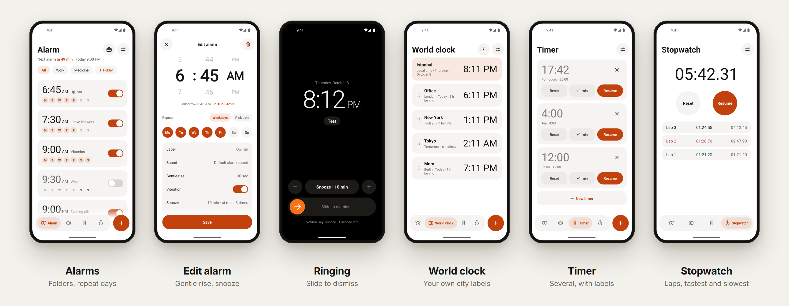
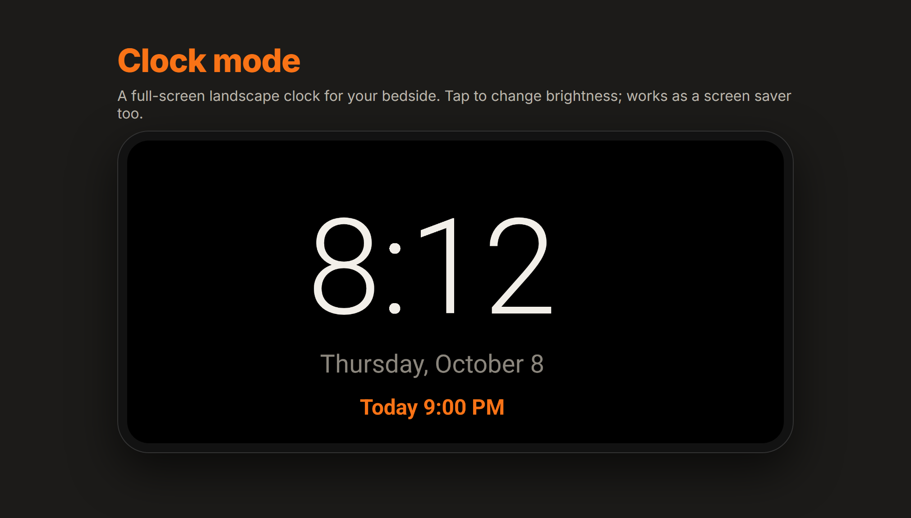

<p align="center">
  
</p>

<p align="center">
  <b>English</b> · <a href="README.tr.md">Türkçe</a> · <a href="../README.md">← Project X</a>
</p>

# Clock

Alarm, timer, stopwatch and world clock. Built around one promise: **your alarm rings.**

**Version 0.11.0** · about 0.8 MB · Android 5.0+ · **[Download](https://github.com/fusion-enjoyer/project-x/releases/tag/saat-v0.11.0)**



## Why it rings

Clock apps fail quietly: a battery saver kills them, a reboot forgets the alarms, a time zone change shifts them by an hour. Clock was written after reading the bug reports of other open-source clocks, and every one of those cases is handled:

- The alarm is set with Android's alarm-clock API, the most reliable way an app can wake the phone.
- After a **reboot** all alarms are set again, **even before you unlock the phone** (the data lives in storage that's readable before the first unlock).
- Daylight saving and time zone changes are safe: an alarm is "7:30 on weekdays", recalculated from the wall clock every time.
- Rings in **silent mode**; if the alarm volume is at zero it is raised for the alarm and put back afterwards.
- A **reliability check** screen shows what is missing (notification permission, exact alarms, lock-screen permission, battery restrictions) with directions for your phone's brand. A red banner warns if something required is off.
- **Test an alarm:** rings in 10 seconds through the real path, so you can see it with the phone locked.

## Features

### Alarm

- Time, label, repeat days, one time, a specific date or a **date range** (every day between two dates).
- **Skip next** without turning the alarm off.
- Gentle rise, vibration, snooze length and how many times; the phone's alarm sounds, your own file or a built-in chime.
- **Folders** ("Work", "Medicine"); swipe left to delete (with undo), swipe right to move to a folder.
- **Vacation mode:** pauses repeating alarms until a date you choose; nothing to turn back on.
- **Wake-up task:** solve a few math problems to dismiss (easy, medium, hard). The notification's Dismiss button can't skip it.

### Ringing screen

- On top of the lock screen, wakes the screen, **slide to dismiss**.
- Change the snooze length with − and + while it rings.
- You choose what the volume keys do; the back button doesn't dismiss by accident. Always dark.
- If you're using the phone, a notification with Snooze / Dismiss appears instead of the full screen.

### Notifications

- Upcoming alarm ("skip this one"), snoozed ("dismiss now"), missed alarm.

### Timer

- Several timers at once, each with a label; +1 min while running.
- Preset chips (1, 3, 5, 10, 15, 30 min) start with one tap; save your own.
- Live countdown in the notification; rings over the lock screen like an alarm.

### Stopwatch

- Hundredths of a second, smooth; laps with the fastest and slowest marked.
- Keeps running across a reboot.

### World clock

- Cities with local names, an A–Z index and search at the bottom.
- Your own labels ("Mom", "Office"); drag to reorder.
- Time difference and "yesterday / tomorrow" at a glance.

### Clock mode and screen saver



A full-screen landscape clock for your bedside: time, date and next alarm. Tap for brightness (very dim, medium, bright); it shifts slightly every minute to avoid burn-in. The same view is a system **screen saver**.

### Widgets and system

- Five widgets: clock + next alarm + cities (4×2), digital clock (2×1), next alarm (2×1), world clocks (4×2), quick timer (4×1, one tap starts a preset).
- Quick settings tile.
- Swipe between tabs. Light, dark or system theme. Turkish and English.

## Android versions

Clock runs on **Android 5.0 and up**. Everything not in this table works on 5.0.

| Feature | Needs |
|---|---|
| Battery restriction check | Android 6.0 |
| Alarms set before the first unlock after a reboot | Android 7.0 |
| Local city and country names (older: names from the time zone) | Android 7.0 |
| Live countdown in the notification (older: shows the end time) | Android 7.0 |
| Quick settings tile (next alarm under it: Android 10) | Android 7.0 |
| Exact alarm permission check | Android 12 |
| Notification permission prompt | Android 13 |
| Lock-screen full-screen permission check | Android 14 |

Tested mostly on Android 14; older versions are supported by design but tested less.

## Permissions

| Permission | Why |
|---|---|
| Exact alarms | Ring at the exact minute |
| Run at startup | Set the alarms again after a restart |
| Notifications, full-screen notification | Show the ringing screen over the lock screen |
| Foreground service (media playback), keep awake | Keep the sound playing while the alarm rings |
| Vibration | Vibrating alarms |

Never internet.

## Coming next

- Sunrise alarm (the screen slowly brightens)
- Bedtime reminder
- Shake or flip to snooze
- More wake-up tasks (type a code, walk some steps), a sound per task

## Build

```bash
./gradlew :saat:assembleRelease
```

`saat` means "clock". It uses the shared design module [`tasarim`](../tasarim).
