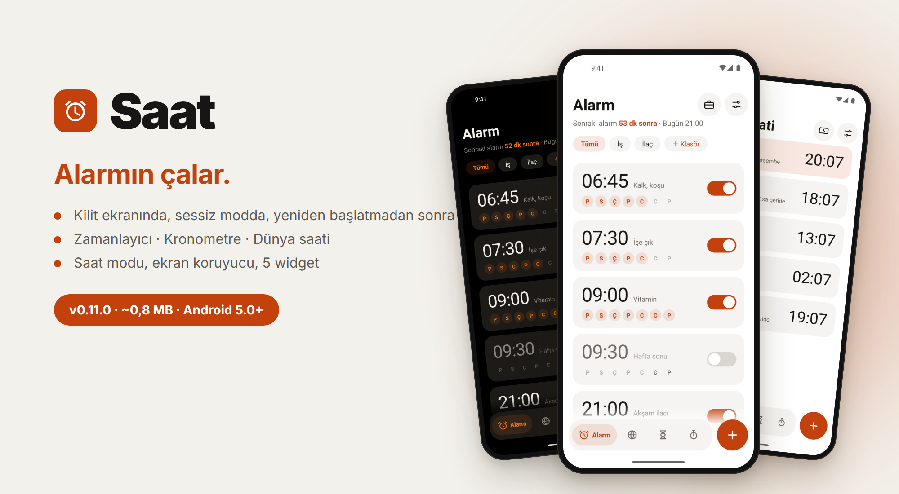
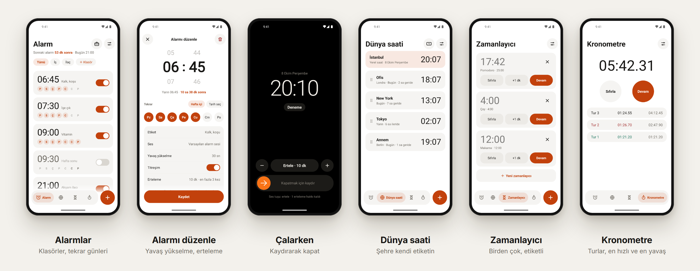
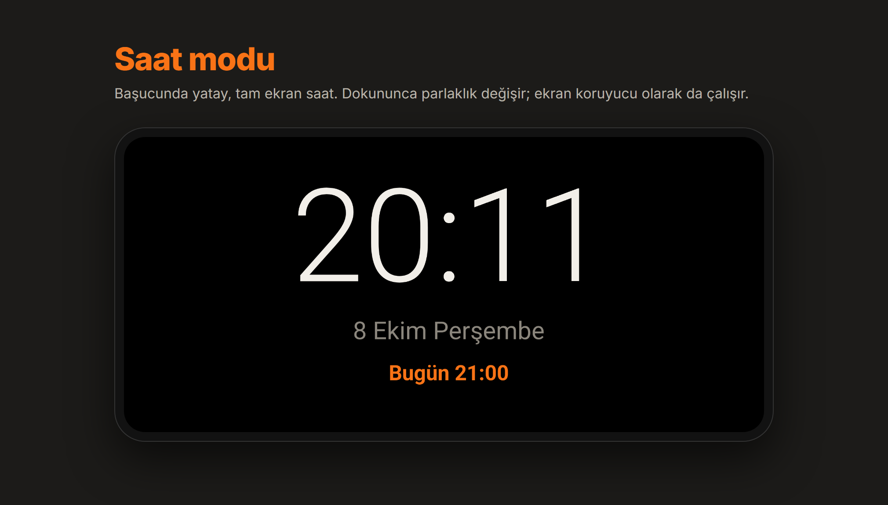

<p align="center">
  
</p>

<p align="center">
  <a href="README.md">English</a> · <b>Türkçe</b> · <a href="../README.tr.md">← Project X</a>
</p>

# Saat

Alarm, zamanlayıcı, kronometre ve dünya saati. Tek bir söz üstüne kurulu: **alarmın çalar.**

**Sürüm 0.11.0** · yaklaşık 0,8 MB · Android 5.0+ · **[İndir](https://github.com/fusion-enjoyer/project-x/releases/tag/saat-v0.11.0)**



## Neden çalar

Saat uygulamaları sessizce bozulur: pil tasarrufu onları öldürür, yeniden başlatma alarmları unutturur, saat dilimi değişince alarm bir saat kayar. Saat, başka açık kaynak saat uygulamalarının hata kayıtları okunduktan sonra yazıldı; bu durumların hepsi ele alındı:

- Alarm, Android'in alarm saati arayüzüyle kurulur: bir uygulamanın telefonu uyandırabileceği en güvenilir yol.
- Telefon **yeniden başlayınca** bütün alarmlar yeniden kurulur, **kilidi hiç açmasan bile** (veri, ilk kilit açılışından önce okunabilen depoda durur).
- Yaz saati ve saat dilimi değişimi güvenli: alarm "hafta içi 07:30"dur, her seferinde duvar saatinden yeniden hesaplanır.
- **Sessiz modda** çalar; alarm sesi sıfırsa çalarken yükseltilir, sonra geri alınır.
- **Güvenilirlik** ekranı neyin eksik olduğunu gösterir (bildirim izni, tam zamanlı alarm, kilit ekranı izni, pil kısıtlaması) ve telefonunun markasına göre yol tarif eder. Zorunlu biri kapalıysa kırmızı şerit uyarır.
- **Alarmı dene:** gerçek yoldan 10 saniye sonra çalar, telefon kilitliyken görmen için.

## Özellikler

### Alarm

- Saat, etiket, tekrar günleri, tek seferlik, belirli bir tarih ya da **tarih aralığı** (iki tarih arasındaki her gün).
- Alarmı kapatmadan **bir sonrakini atla**.
- Yavaş yükselme, titreşim, erteleme süresi ve kaç kez; telefonun alarm sesleri, kendi dosyan ya da yerleşik çan.
- **Klasörler** ("İş", "İlaç"); sola kaydır sil (geri alınabilir), sağa kaydır klasöre taşı.
- **Tatil modu:** tekrarlayan alarmları seçtiğin tarihe kadar susturur; sonra açmayı hatırlaman gerekmez.
- **Uyanma görevi:** kapatmak için birkaç matematik sorusu çöz (kolay, orta, zor). Bildirimdeki Kapat düğmesi görevi atlatmaz.

### Çalma ekranı

- Kilit ekranının üstünde, ekranı uyandırır, **kaydırarak kapat**.
- Çalarken erteleme süresini − ve + ile değiştir.
- Ses tuşlarının ne yapacağını sen seçersin; geri tuşu yanlışlıkla kapatmaz. Hep karanlık.
- Telefonu kullanıyorsan tam ekran yerine Ertele / Kapat düğmeli bildirim çıkar.

### Bildirimler

- Yaklaşan alarm ("bu sefer çalmasın"), ertelendi ("şimdi kapat"), kaçırılan alarm.

### Zamanlayıcı

- Aynı anda birden çok zamanlayıcı, her biri etiketli; çalışırken +1 dk.
- Hazır süre çipleri (1, 3, 5, 10, 15, 30 dk) tek dokunuşla başlar; kendi hazır sürelerini kaydet.
- Bildirimde canlı geri sayım; süre dolunca alarm gibi kilit ekranında çalar.

### Kronometre

- Salisenin yüzde biri, akıcı; turlar, en hızlı ve en yavaş işaretli.
- Telefon yeniden başlasa da saymaya devam eder.

### Dünya saati

- Yerel adlarıyla şehirler, A–Z dizini ve altta arama.
- Kendi etiketlerin ("Annem", "Ofis"); sürükleyerek sırala.
- Saat farkı ve "dün / yarın" bir bakışta.

### Saat modu ve ekran koruyucu



Başucu için yatay, tam ekran saat: saat, tarih ve sonraki alarm. Dokununca parlaklık değişir (çok loş, orta, parlak); ekranda iz kalmasın diye dakikada bir hafifçe kayar. Aynı görünüm telefonun **ekran koruyucusu** olarak da seçilir.

### Widget'lar ve sistem

- Beş widget: saat + sonraki alarm + şehirler (4×2), dijital saat (2×1), sonraki alarm (2×1), dünya saatleri (4×2), hızlı zamanlayıcı (4×1, tek dokunuşla hazır süre başlar).
- Hızlı ayarlar döşemesi.
- Sekmeler arasında kaydırarak geçiş. Açık, koyu ya da sistemle aynı tema. Türkçe ve İngilizce.

## Android sürümleri

Saat **Android 5.0 ve üstünde** çalışır. Bu tabloda olmayan her şey 5.0'da çalışır.

| Özellik | Gereken |
|---|---|
| Pil kısıtlaması kontrolü | Android 6.0 |
| Yeniden başlatmadan sonra ilk kilit açılışından önce alarm kurulması | Android 7.0 |
| Yerel şehir ve ülke adları (eskisinde saat diliminden gelen ad) | Android 7.0 |
| Bildirimde canlı geri sayım (eskisinde bitiş saati yazar) | Android 7.0 |
| Hızlı ayarlar döşemesi (altında sonraki alarm: Android 10) | Android 7.0 |
| Tam zamanlı alarm izni kontrolü | Android 12 |
| Bildirim izni sorusu | Android 13 |
| Kilit ekranında tam ekran izni kontrolü | Android 14 |

Çoğunlukla Android 14'te denendi; eski sürümler tasarım olarak destekleniyor ama daha az denendi.

## İzinler

| İzin | Neden |
|---|---|
| Tam zamanlı alarm | Tam dakikasında çalmak |
| Başlangıçta çalıştır | Telefon yeniden başlayınca alarmları geri kurmak |
| Bildirimler, tam ekran bildirim | Çalma ekranını kilit ekranının üstünde göstermek |
| Ön plan hizmeti (medya çalma), uyanık tutma | Alarm çalarken sesi kesintisiz sürdürmek |
| Titreşim | Titreşimli alarm |

İnternet izni asla yok.

## Sırada ne var

- Gün doğumu alarmı (ekran yavaşça aydınlanır)
- Uyku vakti hatırlatıcısı
- Sallayarak ya da çevirerek erteleme
- Yeni uyanma görevleri (kod yaz, adım at), göreve özel ses

## Derleme

```bash
./gradlew :saat:assembleRelease
```

Ortak tasarım modülü [`tasarim`](../tasarim)'ı kullanır.
