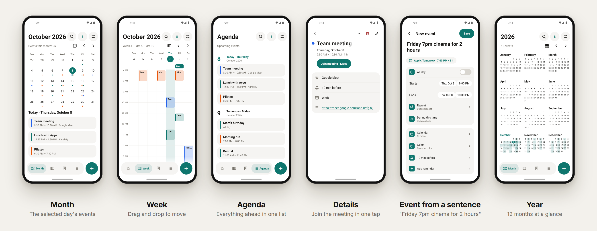

<p align="center">
  
</p>

<p align="center">
  <b>English</b> · <a href="README.tr.md">Türkçe</a> · <a href="../README.md">← Project X</a>
</p>

# Calendar

A calendar that keeps your events on the right day, at the right time. Offline, no account, no internet permission.

**Version 0.11.0** · about 0.9 MB · Android 5.0+ · **[Download](https://github.com/fusion-enjoyer/project-x/releases/tag/takvim-v0.11.0)**



## Where your events live

Events are stored in **your phone's own calendar storage**, the same place every Android calendar uses. That means:

- Calendars synced by **DAVx5** (Nextcloud, Radicale, any CalDAV server) or by an account on the phone show up without this app ever touching the internet.
- Repeating events ("the second Tuesday of every month") are handled by Android.
- No phone calendar yet? One tap creates a calendar that lives only on the phone.

## Features

### Views

- **Month:** dots, or titles right in the grid (detailed); the selected day's events underneath.
- **Year:** 12 months at a glance, optionally as a heat map of your busiest days.
- **Week** (7 or 3 days) and **Day** (time grid or list) with overlapping events side by side, a "now" line and an all-day strip.
- **Agenda:** everything ahead in one list.
- Pinch to zoom the time grid or switch the month layout; every gesture also has a visible button.

### Events

- Title, all day, start and end, location, notes, calendar, color, several reminders.
- Repeats: ready-made and custom (every N days/weeks, weekdays, day of the month, the Nth weekday, until a date or N times).
- Editing a repeating event asks: only this one, this and following, or all.
- **Drag and drop** in the week and day views to move an event; drag the handle to change its length. Undo for both.
- Busy / free status; duplicate an event; undo after deleting.

### Type it in one sentence

Type "**tomorrow 2:30pm dentist for 2 hours**", "**every monday 9am team meeting**" or "**Oct 15 all day birthday**" and the date, time, length and repeat are filled in. Works in Turkish and English, entirely on the phone.

### Invitations and meetings

- Reply Yes / Maybe / No to invitations; the reply goes to the server for synced calendars. See the guest list.
- A **Join meeting** button for Meet, Zoom, Teams, Webex, Jitsi and Whereby links, also in the reminder notification.

### More

- **Reminders** with snooze; they come back after a restart.
- **Birthdays** from your contacts (optional; nothing is written anywhere), with age.
- **Daily summary** notification every morning (optional; silent on empty days).
- **.ics** import and export: all calendars or one, with repeats, time zones, reminders and exceptions. Importing the same file twice doesn't duplicate.
- Search titles, locations and notes, ignoring Turkish accents.
- Manage calendars: create several phone calendars, rename, recolor, delete; show or hide synced ones.
- Three widgets: agenda, month, next event. Quick settings tile and app shortcuts.
- Light, dark or system theme. Turkish and English. Screen reader support down to each event in the grid.

## Android versions

Calendar runs on **Android 5.0 and up**. Everything not in this table works on 5.0.

| Feature | Needs |
|---|---|
| Quick settings tile | Android 7.0 |
| App shortcuts (hold the app icon) | Android 7.1 |
| Notification permission prompt | Android 13 |

Tested on Android 14 so far; Android 5 to 9 are supported by design but not yet tested on a device.

## Permissions

| Permission | Why |
|---|---|
| Calendar (read and write) | Your events live in the phone's calendar |
| Contacts | Optional: birthdays. Asked only when you turn it on |
| Notifications | Reminders and the daily summary |
| Run at startup | Put snoozed reminders back after a restart |
| Exact alarms | Snooze rings on time |

Never internet.

## Coming next

- Public holidays (switch on), religious holidays and the Hijri date (off by default)
- A link with Clock's vacation mode
- Pin events to a time zone
- More languages

## Build

```bash
./gradlew :takvim:assembleRelease
```

`takvim` means "calendar". It uses the shared design module [`tasarim`](../tasarim).
