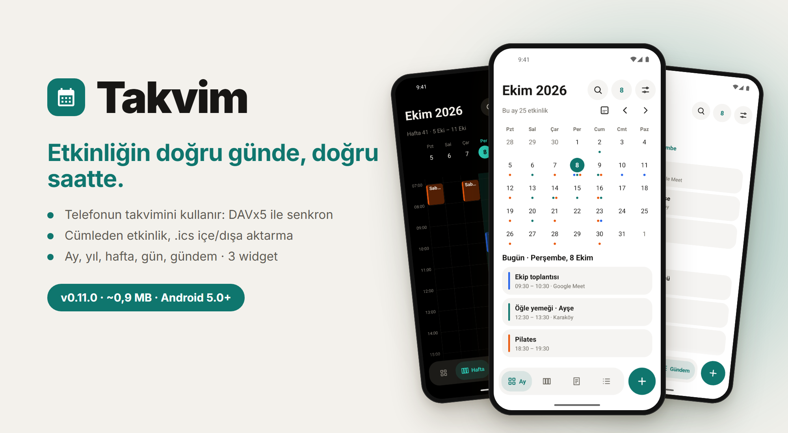
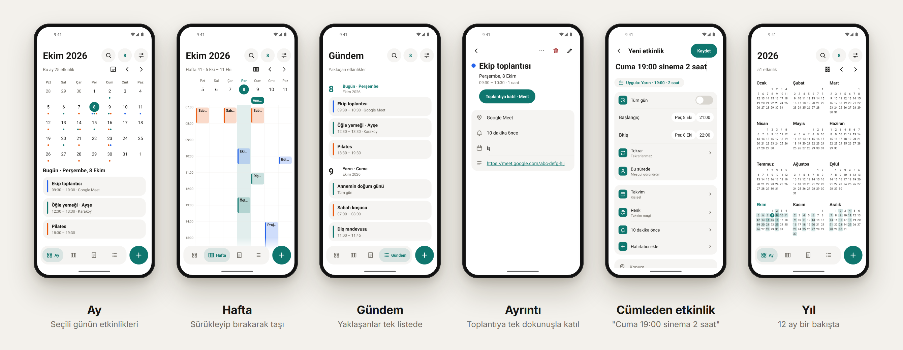

<p align="center">
  
</p>

<p align="center">
  <a href="README.md">English</a> · <b>Türkçe</b> · <a href="../README.tr.md">← Project X</a>
</p>

# Takvim

Etkinliğini doğru günde, doğru saatte tutan bir takvim. Çevrimdışı, hesapsız, internet izni yok.

**Sürüm 0.11.0** · yaklaşık 0,9 MB · Android 5.0+ · **[İndir](https://github.com/fusion-enjoyer/project-x/releases/tag/takvim-v0.11.0)**



## Etkinliklerin nerede durur

Etkinlikler **telefonun kendi takvim deposunda** saklanır; her Android takviminin kullandığı yerde. Yani:

- **DAVx5** ile (Nextcloud, Radicale, herhangi bir CalDAV sunucusu) ya da telefondaki bir hesapla senkronlanan takvimler, bu uygulama internete hiç dokunmadan görünür.
- Tekrarlayan etkinlikleri ("her ayın ikinci salısı") Android hesaplar.
- Telefonda hiç takvim yok mu? Tek dokunuşla yalnız telefonda duran bir takvim oluşur.

## Özellikler

### Görünümler

- **Ay:** noktalar ya da başlıklar doğrudan ızgarada (ayrıntılı); altında seçili günün etkinlikleri.
- **Yıl:** 12 ay bir bakışta; istersen en yoğun günlerinin ısı haritası.
- **Hafta** (7 ya da 3 gün) ve **Gün** (saat ızgarası ya da liste): çakışan etkinlikler yan yana, "şimdi" çizgisi, tüm gün şeridi.
- **Gündem:** yaklaşan her şey tek listede.
- İki parmakla saat ızgarasını büyüt ya da ay düzenini değiştir; her hareketin görünür bir düğmesi de var.

### Etkinlikler

- Başlık, tüm gün, başlangıç ve bitiş, konum, açıklama, takvim, renk, birden çok hatırlatıcı.
- Tekrar: hazır seçenekler ve özel (her N günde/haftada, hafta günleri, ayın günü, ayın N. haftası, bir tarihe kadar ya da N kez).
- Tekrarlayan etkinliği düzenlerken sorar: yalnız bu, bu ve sonrakiler ya da hepsi.
- Hafta ve gün görünümünde **sürükle-bırak** ile taşı; tutamaktan çekerek süresini değiştir. İkisi de geri alınabilir.
- Meşgul / uygun durumu; etkinliği çoğalt; sildikten sonra geri al.

### Tek cümleyle yaz

"**yarın 14:30 diş randevusu 2 saat**", "**her pazartesi 09:00 toplantı**" ya da "**15 Ekim tüm gün doğum günü**" yaz; tarih, saat, süre ve tekrar kendiliğinden dolar. Türkçe ve İngilizce, tamamen telefonda.

### Davetler ve toplantılar

- Davetlere Evet / Belki / Hayır de; senkronlu takvimde yanıt sunucuya gider. Davetli listesini gör.
- Meet, Zoom, Teams, Webex, Jitsi ve Whereby bağlantıları için **Toplantıya katıl** düğmesi; hatırlatıcı bildiriminde de var.

### Dahası

- Ertelenebilen **hatırlatıcılar**; telefon yeniden başlasa da geri gelir.
- Rehberden **doğum günleri** (isteğe bağlı; hiçbir yere yazılmaz), yaşıyla birlikte.
- Her sabah **günlük özet** bildirimi (isteğe bağlı; boş günde sessiz).
- **.ics** içe ve dışa aktarma: bütün takvimler ya da biri; tekrarlar, saat dilimleri, hatırlatıcılar ve istisnalarla. Aynı dosyayı iki kez içe aktarmak çiftlemez.
- Başlık, konum ve açıklamada arama, Türkçe karakterden bağımsız.
- Takvimleri yönet: telefonda birden çok takvim aç, adını ve rengini değiştir, sil; senkronlu olanları göster ya da gizle.
- Üç widget: gündem, ay, sıradaki etkinlik. Hızlı ayarlar döşemesi ve uygulama kısayolları.
- Açık, koyu ya da sistemle aynı tema. Türkçe ve İngilizce. Ekran okuyucu desteği, ızgaradaki her etkinliğe kadar.

## Android sürümleri

Takvim **Android 5.0 ve üstünde** çalışır. Bu tabloda olmayan her şey 5.0'da çalışır.

| Özellik | Gereken |
|---|---|
| Hızlı ayarlar döşemesi | Android 7.0 |
| Uygulama kısayolları (simgeye basılı tut) | Android 7.1 |
| Bildirim izni sorusu | Android 13 |

Şimdiye dek Android 14'te denendi; Android 5–9 tasarım olarak destekleniyor ama henüz bir cihazda denenmedi.

## İzinler

| İzin | Neden |
|---|---|
| Takvim (okuma ve yazma) | Etkinliklerin telefonun takviminde durur |
| Rehber | İsteğe bağlı: doğum günleri. Yalnız açınca sorulur |
| Bildirimler | Hatırlatıcılar ve günlük özet |
| Başlangıçta çalıştır | Telefon yeniden başlayınca ertelenmiş hatırlatıcıları geri kurmak |
| Tam zamanlı alarm | Ertelenen hatırlatıcı zamanında çalsın |

İnternet izni asla yok.

## Sırada ne var

- Resmî tatiller (anahtarla), dini bayramlar ve Hicri tarih (varsayılan kapalı)
- Saat'in tatil moduyla bağlantı
- Etkinliği bir saat dilimine sabitleme
- Başka diller

## Derleme

```bash
./gradlew :takvim:assembleRelease
```

Ortak tasarım modülü [`tasarim`](../tasarim)'ı kullanır.
